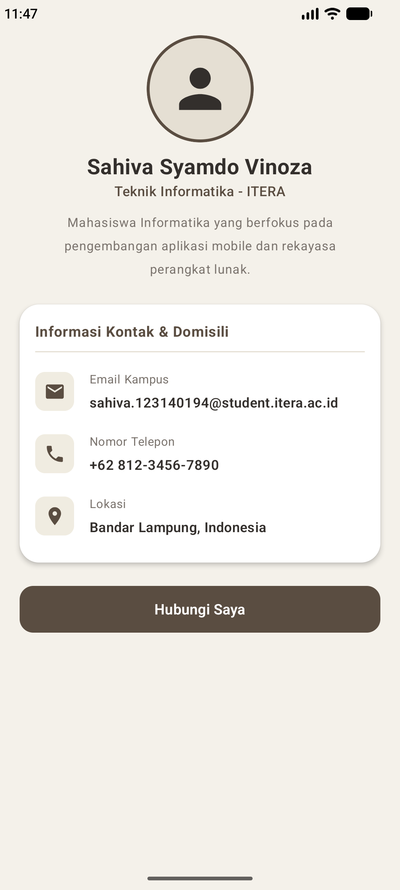

# Tugas 3 - My Profile App (Jetpack Compose)

Aplikasi profil pribadi sederhana yang dibangun menggunakan **Android Studio** dan **Jetpack Compose** dengan menerapkan prinsip *Reusable Composable Functions* dan estetika desain modern bernuansa *earthy* (gaya Hirono).

## 📱 Fitur & Komponen Utama
- **Header Profil:** Foto profil berbentuk lingkaran (*circular*), nama, dan bio singkat.
- **List Informasi:** Email kampus, Nomor Telepon, dan Lokasi.
- **Reusable Composable:** `ProfileHeader`, `InfoItem`, dan `ProfileCard`.

## 📸 Screenshot Aplikasi

